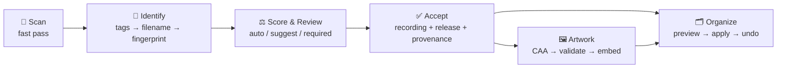
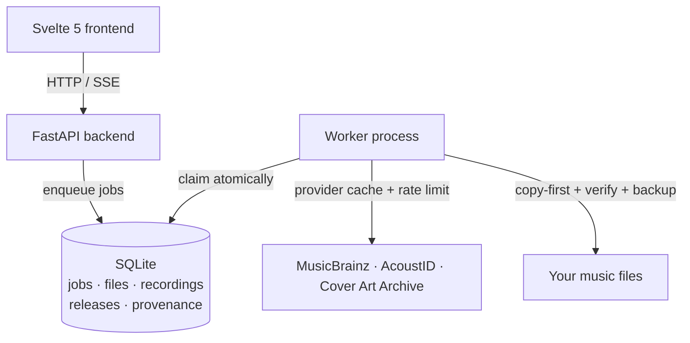

<div align="center">


# TuneVault

**The audiophile's music library — intelligently organized, never destroyed.**

A local-first, self-hosted music server that scans your collection, identifies
every track, enriches it with canonical metadata, artwork and release
information — and can safely reorganize your files with **full undo**.

[Quickstart](#-quickstart) ·
[Why TuneVault?](#-why-tunevault) ·
[How It Works](#-how-it-works) ·
[Project Status](#-project-status)

[](LICENSE)
[](https://www.python.org)
[](https://fastapi.tiangolo.com)
[](https://svelte.dev)
[](https://sqlite.org)
[](backend/tests)
[](#-safety-by-design)

</div>

---

## ✨ Why TuneVault?

Taggers and renamers are scary. One wrong batch and years of careful curation
are gone. TuneVault is built on a single non-negotiable principle:

> **Never Destroy.** No file is ever modified, moved or deleted without a
> verified copy, a byte-identical backup, and a path back to the original.

On top of that foundation it gives your library what a spreadsheet of folders
never could:

| | What you get |
|---|---|
| 🧠 **Identification** | MusicBrainz + AcoustID fingerprint matching with weighted scoring — even files with terrible names and zero tags are identified from filename evidence |
| 📜 **Provenance** | Every metadata value remembers *where it came from* and how confident it is — you can always audit why a field says what it says |
| 🖼 **Artwork** | Cover Art Archive lookup, image validation & quality scoring, cached and embedded on demand |
| 🔊 **Audiophile intelligence** | EBU R128 loudness, spectral analysis and **upsample detection** — find the 44.1 kHz audio hiding in your "hi-res" 96 kHz files |
| 🗂 **Safe organization** | Dry-run by default, preview every change, apply atomically, undo byte-identically |
| 🏠 **Local-first** | Your files, your SQLite database, your machine. No cloud, no accounts, no telemetry |

---

## 🚀 Quickstart

### Docker (recommended)

```bash
git clone https://github.com/WTRois/tunevault.git
cd tunevault
cp .env.example .env          # point MUSIC_DIR at your library
docker compose up --build
```

| Service | URL |
|---|---|
| Web UI | http://localhost:5173 |
| REST API | http://localhost:8000 |
| API docs (OpenAPI) | http://localhost:8000/docs |

### Local development

```bash
# backend API
cd backend
uv run uvicorn backend.main:app --reload

# worker (separate terminal — processes the job queue)
cd backend
uv run python -m backend.workers.worker

# frontend
cd frontend
npm install && npm run dev
```

Then open http://localhost:5173, hit **Scan**, and watch your library
come to life.

---

## 🧠 How It Works

TuneVault never guesses-and-writes. Every mutation is planned, reviewed,
verified — and reversible.



### The pipeline

1. **Scan** — unchanged files are skipped entirely (size + mtime); new files
   are hashed and indexed into a proper music domain model:
   `files → recordings → artists`, `release_groups → releases → release_tracks`.
2. **Identify** — evidence is gathered in a strict order (embedded tags →
   filename parse → AcoustID fingerprint) and scored against MusicBrainz.
   Candidates above the auto-apply threshold are marked for you; nothing is
   ever written silently.
3. **Review** — a library-wide review queue with confidence filters and
   bulk accept (best candidate per file), or accept/reject per song.
   Accepting links your file to a canonical recording **and** a concrete
   release (with your release preferences: original, remaster, hi-res…).
4. **Artwork** — cover art candidates are fetched, validated (dimensions,
   aspect ratio, corruption), quality-scored, cached, and embedded only when
   you ask.
5. **Organize** — every rename/tag-write becomes a **change plan** you can
   preview. Applying is copy-first with SHA verification and per-file
   backups; **undo restores every original byte-identically**.

### Architecture

Three containers, one SQLite database, one job queue:



The worker is a separate process: progress survives API restarts, and you can
scale it (`docker compose scale worker=N`) — job claiming is atomic.

---

## 🔒 Safety by Design

Every organization feature is built on the **Never Destroy** pillars:

- **Dry-run by default** — `ORGANIZE_DRY_RUN=true` makes the apply engine
  physically refuse filesystem writes until you explicitly enable it.
- **Copy-first + verify** — a file is only deleted *after* a SHA-verified
  copy of its new state exists somewhere else.
- **Byte-identical backups** — the original bytes of every changed file are
  kept, so **undo** restores exactly what was there before.
- **Collision policy** — identical content at the target is never
  overwritten and never duplicated; different content gets a suffixed name.
- **Path sandbox** — every read and write is validated against the
  configured roots; traversal and symlink escapes are rejected.

> Suspicious findings (like possible upsamples) are **warnings, never
> verdicts** — TuneVault tells you what to double-check, and never acts on
> audio forensics automatically.

---

## ⚙️ Configuration

Everything is environment-driven — see the fully documented
[`.env.example`](.env.example). The essentials:

| Variable | Default | Notes |
|---|---|---|
| `MUSIC_DIR` | `/music` | Library root — all file operations are sandboxed here |
| `ORGANIZE_DRY_RUN` | `true` | Apply engine refuses FS writes while true |
| `CREATE_BACKUPS` | `true` | Undo artifacts; `false` disables undo |
| `ACOUSTID_API_KEY` | *(empty)* | Empty → fingerprint identification disabled |
| `LOG_FORMAT` | `json` | Structured JSON logs; `pretty` for local dev |

Identification thresholds, release preferences, job queue tuning and
provider endpoints are all configurable too — and startup **fails fast** on
missing or inconsistent required config.

---

## 🧪 Testing

```bash
cd backend
uv run pytest -q          # 226 tests — fully offline, providers mocked
uv run ruff check .       # lint
```

The suite includes a full **end-to-end roundtrip** (`backend/tests/e2e/`):
scan → identify → artwork → organize → undo, with two badly-named untagged
files, a wrong-candidate rejection, a rename collision, and a worker-restart
retry — proving the safety claims above, not just the happy path.

```bash
cd frontend
npm run check && npm run lint && npm run build
```

---

## 📊 Project Status

**V2 complete** — all 39 tasks across 7 phases
(hardening → domain model → identification → artwork → safe organization →
audiophile intelligence → library intelligence → advanced UX) are done and
verified, with a 226-test offline suite including a full end-to-end roundtrip.

---

## 🤝 Contributing

Issues and pull requests are very welcome — this project exists to be useful.

1. Fork & clone, then set up the dev environment from the
   [Quickstart](#-quickstart) above.
2. Keep the safety invariants: anything that touches files must stay
   dry-run-safe, copy-first, verified and undoable.
3. New features must come with offline tests (never depend on the internet
   in the test suite).
4. Run `uv run ruff check . && uv run pytest -q` before opening a PR.

Found a bug? A track TuneVault identifies wrong? Open an
[issue](https://github.com/WTRois/tunevault/issues) with the filename
pattern (no need to share your files) and what you expected.

## 📄 License

[MIT](LICENSE) © 2026 Muhammad Rois Akbar

<div align="center">

**⭐ If TuneVault saved your library, star it — it helps other collectors find it.**

</div>